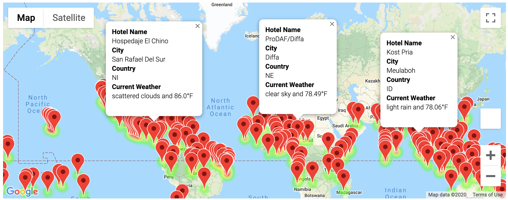
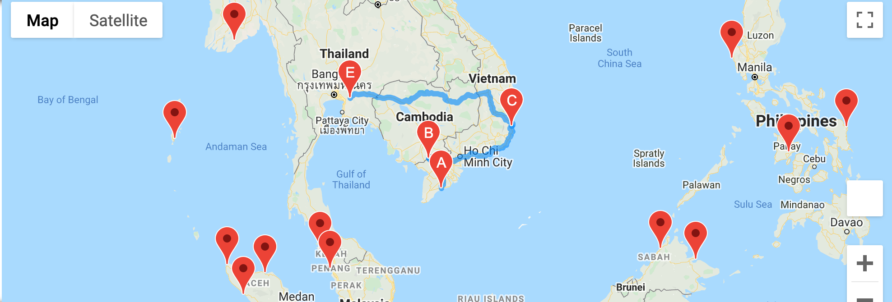
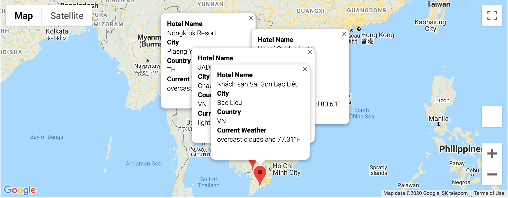

# World Weather Analysis
In this project, I have successfully requested data via an API call from OpenWeatherMap. This data was then used to create visualizations via Matplotlib & Matlab. In addition to this, I used Google's API to create heatmaps via gmaps. 

## Overview
The purpose of this project is to be able to map cities throughout the world, and give customers the capability of choosing their weather preferences. This incorporates mapping weather conditions, having customers choose their ideal weather, providing nearby lodging based on weather and building an intinerary for a trip. 
## Results 
By asking for a user's temperature preference, we are able to generate a map that displays a temperature view, and markers for hotels that fall within the temperature preference. In this example, I have chosen my ideal travel weather to be between 75-90 degree F

### Weather Vacation Map 

By looking at this map, customers can clearly see what areas are within their temperature preference and the hotels suggested for those cities. Customers can use this interactive map to begin planning an itinerary, with the cities and hotels provided. 

### Travel Itinerary Map

As my example, I have planned a trip throughout Vietnam and Thailand in Southeast Asia. Next step would be planning what hotels I would be staying at throughout these cities.

### Itinerary Hotels 

Here are the different hotels I have planned to stay at during my travels. 

## Summary 

This project uses a random lat & lon generator to map out cities across the world that can be traveled to. By utilizing weather information, we can help customers plan a trip based on their ideal weather conditions. From there, a vacation itinerary can be planned utilizing Google APIs. 
